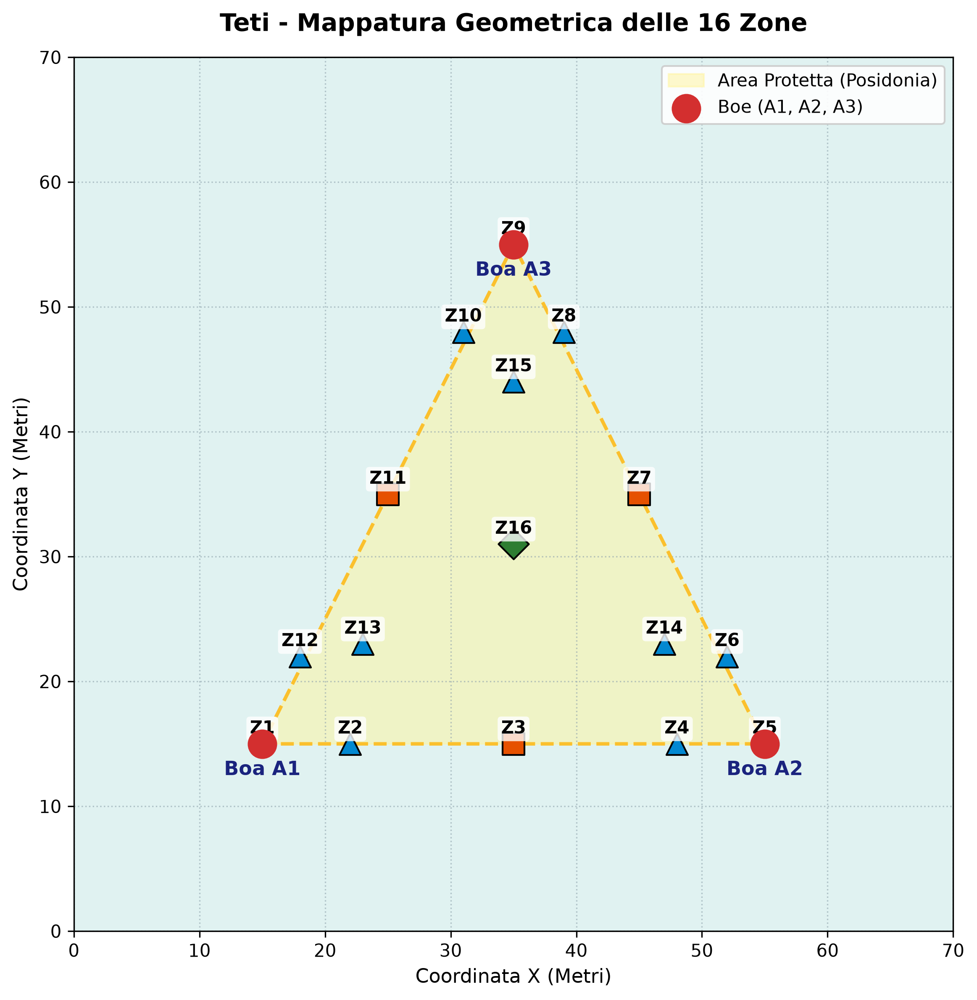

# Teti — Real-Time BLE Boat Triangulation

Indoor/outdoor BLE RSSI-fingerprinting prototype that estimates a boat's position within a triangle of three anchor buoys, using k-NN classification against a simulated (or field-calibrated) fingerprint database. Built as a testbed ahead of full deployment for the **Posidonia Guardian** maritime monitoring project, using 3× ST NUCLEO-WB55RG boards standing in for the buoys.



## How it works

- **1 Master board** runs `BLE_p2pClient` in passive-sniffer mode: it scans continuously for a target BLE device (`"MyPhone"`, standing in for the boat) and for advertising packets relayed by the two anchor boards, then classifies the current RSSI vector `[A1, A2, A3]` against a k-NN fingerprint database and prints the estimated zone over serial.
- **2 Anchor boards** (also `BLE_p2pClient`, distinguished by an `ANCHOR_ID` build define) independently measure their own RSSI reading of the target device, then broadcast it as a BLE advertisement name (`"A<id>:<rssi>"`) so the master can pick it up.
- A **Python GUI** (`gui/main.py`) reads the master's serial output and renders live boat position, RSSI values, and a "loitering inside the protected area" risk score on a 2D map.
- The k-NN fingerprint database (`data/training_set.h`) is generated offline by `data/data_gen.py`, which simulates expected RSSI at the centroid of each cell in a configurable grid using a log-distance path-loss model, based on real buoy geometry defined once in `data/zone_coordinates.py`.

## Repository structure

```
.
├── BLE_p2pClient/          # STM32CubeIDE firmware project (anchor + master share this codebase)
│   ├── STM32_WPAN/App/
│   │   ├── app_ble.c       # BLE event handling: RSSI capture, relay advertising, name parsing
│   │   └── p2p_client_app.c
│   ├── Core/Src/main.c     # k-NN zone classification + serial telemetry output
│   ├── Core/Inc/           # copy the generated data/training_set.h here before building
│   └── Binary/             # reference .hex build
├── data/
│   ├── zone_coordinates.py # single source of truth: buoy positions, grid layout, world bounds
│   ├── data_gen.py         # simulates per-zone RSSI centroids -> training_set.h
│   └── training_set.h      # generated k-NN fingerprint database (C header)
├── gui/
│   ├── main.py              # Tkinter dashboard: map, telemetry, buoy position editor
│   └── mapping.py           # canvas <-> world coordinate transforms
├── src/
│   ├── serial/
│   │   ├── receiver.py       # standalone serial port lister/dumper (debugging utility)
│   │   └── serialRoutine.py  # background thread: reads + parses master's serial telemetry
│   └── tracking/
│       └── trackingRoutine.py # stationarity tracking + in-protected-area risk scoring
├── config.py
├── requirements.txt
├── setup.sh                 # one-time venv + dependency setup
├── run.sh                   # activates venv and launches the GUI
└── structure.txt
```

> **Note:** this repo currently contains a single `BLE_p2pClient` firmware project shared by all three boards (master + 2 anchors), differentiated by an `ANCHOR_ID`/role build define. If the master runs from a separate CubeIDE project in your setup, add it here (e.g. as `BLE_p2pServer_Master/`) and update this section accordingly.

## Hardware

- 3× ST **NUCLEO-WB55RG** boards (1 master, 2 anchors)
- A BLE device to track (phone, tag, etc.) advertising under the name `"MyPhone"`
- USB connection from the master board to the host running the GUI

## Firmware setup

1. Open `BLE_p2pClient/BLE_p2pClient.ioc` in STM32CubeIDE (or use the `EWARM`/`MDK-ARM` project files for IAR/Keil).
2. For each board, set its role/ID before building:
   - **Master:** sniffer mode (passive observation + k-NN classification, serial telemetry output).
   - **Anchor 2 / Anchor 3:** set `ANCHOR_ID` to `2` or `3` respectively.
3. Regenerate the fingerprint database first (see below), copy `data/training_set.h` into `BLE_p2pClient/Core/Inc/`, then build and flash each board with its corresponding role.

## Generating the fingerprint database

Buoy positions, world bounds, and grid resolution are defined once in `data/zone_coordinates.py`. To regenerate the training set after changing any of those:

```bash
cd data
python3 data_gen.py
```

This writes `data/training_set.h`. Copy it into the firmware project's include path (`BLE_p2pClient/Core/Inc/`) and rebuild the master before flashing.

## Running the GUI

```bash
./setup.sh   # first time only: creates a venv and installs requirements.txt
./run.sh     # activates the venv and launches gui/main.py
```

The GUI auto-detects the master's serial port; if the configured `SERIAL_PORT` in `config.py` isn't found, it falls back to the first available port. Live telemetry, a draggable/editable buoy layout, and a boat-position risk indicator are shown once the master starts streaming `RSSI: [A1=.., A2=.., A3=..] -> Position estimated: ZONE n` lines.

## Known limitations / next steps

- Fingerprint centroids are currently simulated from a path-loss model rather than measured in the field — accuracy will improve once real RSSI logs are used to calibrate or override individual zones.
- Grid resolution, buoy layout, and world bounds are all defined in one place (`data/zone_coordinates.py`) but require a full firmware rebuild + reflash of the master to take effect.
- No persistence/logging of telemetry history yet (each session starts fresh).

# Contact
Matteo Gottardelli - matteogottardelli@gmail.com
